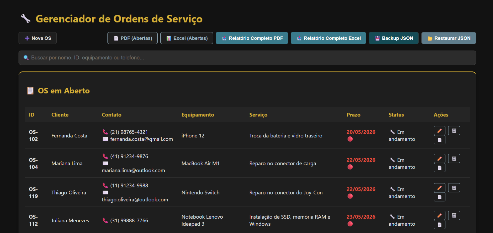
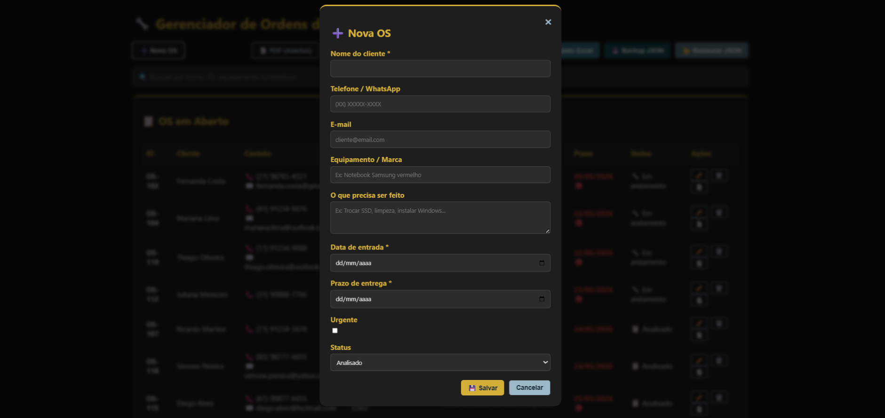
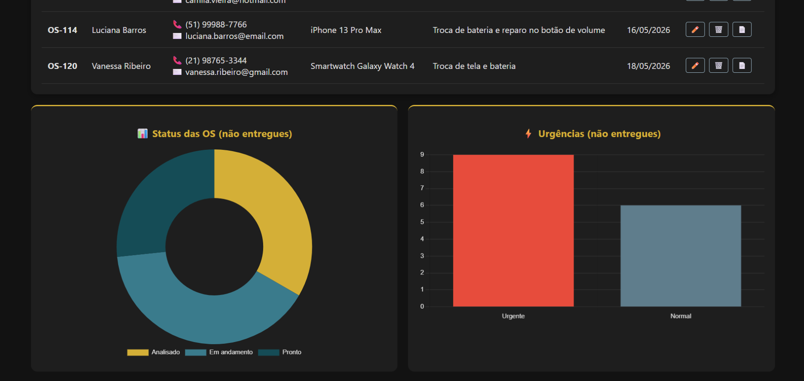

# 🔧 Gerenciador de Ordens de Serviço (Assistência Técnica)

> Sistema 100% front-end para controle de ordens de serviço em assistências técnicas.  
> Com **tema escuro**, **modal elegante**, **ordenação inteligente**, **gráficos dinâmicos** e **backup/restore em JSON**.

---

## 📸 Capturas de Tela

<!-- Insira suas imagens aqui (substitua os links pelos seus prints) -->

| Dashboard e listagem | Modal de cadastro | Gráficos |
|----------------------|-------------------|----------|
|  |  |  |

> 

---

## 🚀 Funcionalidades

- ✅ **Cadastro, edição e exclusão** de ordens de serviço (via modal)
- ✅ **Ordenação automática**:
  - 🔴 Urgentes ou com prazo ≤ 2 dias → no topo
  - 🟢 OS com status "Pronto" → no final
  - Os demais no meio, ordenados por prazo
- ✅ **Busca instantânea** por nome, ID, equipamento ou telefone
- ✅ **Gráficos dinâmicos** (status das OS e urgências) usando Chart.js
- ✅ **Exportação em PDF e Excel (CSV)** – lista parcial ou completa
- ✅ **Backup completo em JSON** e restauração com confirmação
- ✅ **Tema escuro** com paleta de cores personalizável (variáveis CSS)
- ✅ **Responsivo** – funciona em celulares, tablets e desktops
- ✅ **Persistência local** (localStorage) – os dados ficam salvos no navegador
- ✅ **Modal com rolagem interna** – não corta o formulário em telas pequenas

---

## 🎨 Paleta de Cores

| Cor | Nome | Hex |
|-----|------|-----|
| 🟦  |Deep Ocean | `#154C56` |
| 🟩  |Tidal Blue | `#3A7B8C` |
| 🟨  | Goldan Dune | `#D4AF37` |
| ⬜  |vory Sand | `#F5F0E6` (usada em detalhes) |
| ⬜  |ky Mist | `#9CB7C7` |
| ⬛  |Midnight | `#1A2D3C` |
| 🔵  |Blue Ash | `#5F7D8C` |

As cores são facilmente alteráveis no `:root` do CSS.

---

## 🛠️ Tecnologias Utilizadas

- **HTML5** – estrutura semântica, modal, tabelas
- **CSS3** – variáveis CSS, flexbox, grid, responsividade, tema escuro
- **JavaScript (ES6+)** – toda a lógica de negócio, manipulação do DOM, localStorage
- **Chart.js** – gráficos de rosca (status) e barras (urgência)
- **jsPDF + jspdf-autotable** – geração de PDFs com tabelas
- **LocalStorage** – persistência dos dados no navegador

Nenhum servidor ou banco de dados externo é necessário.

---
